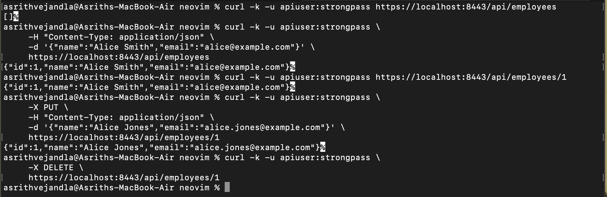
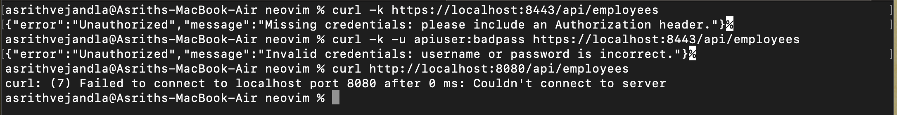

# Secure Employee Service

## Project Overview  
This Spring Boot application exposes a secured REST API for managing Employee records. All communication is encrypted over HTTPS and protected with HTTP Basic authentication. The service uses Spring Data JPA to persist Employee entities in an in-memory H2 database, and it enforces safe parameter binding to eliminate SQL injection vulnerabilities.

## Features  
1. **TLS Encryption**: Embedded Tomcat configured with a PKCS#12 keystore for HTTPS on port 8443.  
2. **Authentication**: HTTP Basic auth backed by an in-memory user store (`apiuser` / `strongpass`).  
3. **CRUD Endpoints**: Create, Read, Update, Delete operations on `/api/employees`.  
4. **Custom Error Handling**: JSON responses for missing or invalid credentials.  

## Prerequisites  
- Java 21 (LTS)  
- Maven 3.8+ (or the included Maven Wrapper)  
- A terminal or command prompt  

## Getting Started  

### 1. Clone the repository  
```bash
git clone https://github.com/ImAsrith/Secure_App_Project
cd secure-app
````

### 2. Verify or generate the keystore

A valid `keystore.p12` is included in `src/main/resources`. If you need to regenerate it, run:

```bash
rm src/main/resources/keystore.p12
keytool -genkeypair \
  -alias springboot \
  -keyalg RSA \
  -keysize 2048 \
  -validity 3650 \
  -storetype PKCS12 \
  -keystore keystore.p12 \
  -storepass changeit \
  -keypass changeit \
  -dname "CN=localhost, OU=Dev, O=YourOrg, L=City, S=State, C=US"
mv keystore.p12 src/main/resources/
```

The keystore password (`changeit`) is set in `src/main/resources/application.properties`.

### 3. Build the application

```bash
./mvnw clean package
```

### 4. Run the application

```bash
# Option A: Maven
./mvnw spring-boot:run

# Option B: Executable JAR
java -jar target/secure-app-0.0.1-SNAPSHOT.jar
```

Once started, the service listens on `https://localhost:8443`.

## API Usage

All endpoints require HTTP Basic authentication with:

* **Username:** `apiuser`
* **Password:** `strongpass`

Below are example `curl` commands. The `-k` flag tells `curl` to trust the self-signed certificate.

1. **List all employees (initially empty)**

   ```bash
   curl -k -u apiuser:strongpass https://localhost:8443/api/employees
   # → []
   ```

2. **Create a new employee**

   ```bash
   curl -k -u apiuser:strongpass \
        -H "Content-Type: application/json" \
        -d '{"name":"Alice Smith","email":"alice@example.com"}' \
        https://localhost:8443/api/employees
   # → {"id":1,"name":"Alice Smith","email":"alice@example.com"}
   ```

3. **Read an employee by ID**

   ```bash
   curl -k -u apiuser:strongpass https://localhost:8443/api/employees/1
   # → {"id":1,"name":"Alice Smith","email":"alice@example.com"}
   ```

4. **Update an existing employee**

   ```bash
   curl -k -u apiuser:strongpass \
        -X PUT \
        -H "Content-Type: application/json" \
        -d '{"name":"Alice Jones","email":"alice.jones@example.com"}' \
        https://localhost:8443/api/employees/1
   # → {"id":1,"name":"Alice Jones","email":"alice.jones@example.com"}
   ```

5. **Delete an employee**

   ```bash
   curl -k -u apiuser:strongpass \
        -X DELETE \
        https://localhost:8443/api/employees/1
   # → (no content)
   ```

## Security Demonstration

Below are two screenshots saved in the `outputs/` folder. They show the API’s secure behavior and custom error responses:

1. **CRUD Operations**
   

2. **Unauthorized Access**
   

In the second screenshot, we can see distinct JSON error messages for requests with no credentials versus wrong credentials, proving that the application requires valid authentication before granting access.


